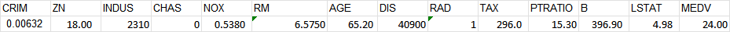
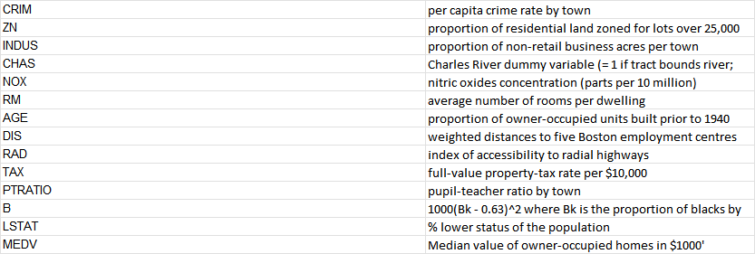
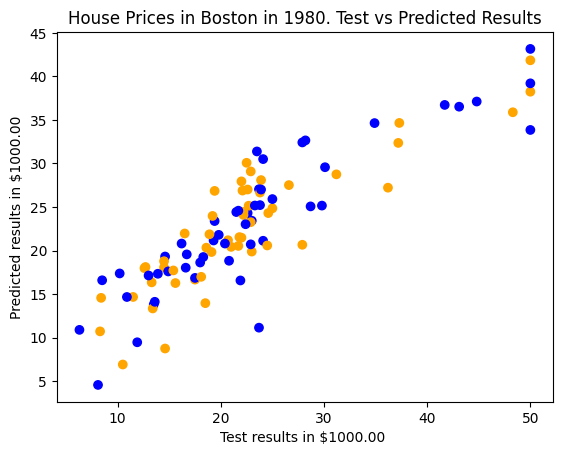

# Predicting House prices in Boston

With Linear Regression using house-price data of Harrison, D. and Rubinfeld, D.L. 'Hedonic
 prices and the demand for clean air', J. Environ. Economics & Management,
 vol.5, 81-102, 1978 (http://lib.stat.cmu.edu/datasets/boston) to predict house prices.

## Table of Contents

- [Project Description](#project-description)
- [Installation](#installation)
- [Usage](#usage)

## Project Description

The dataset is constructed as : 

where

The task is to use the 'MEDV' column as the target(y) and the rest as the data(X).

## Installation
After installing pandas and numpy we get the data and target mentioned above.

data_url = "http://lib.stat.cmu.edu/datasets/boston"  
raw_df = pd.read_csv(data_url, sep="\s+", skiprows=22, header=None)  
data = np.hstack([raw_df.values[::2, :], raw_df.values[1::2, :2]])  
target = raw_df.values[1::2, 2]

Other modules that are installed in this project include:  
-from sklearn.linear_model import LinearRegression (importing the prediction model)  
-from sklearn.model_selection import train_test_split (importing the train-test split module)    
-from sklearn.impute import SimpleImputer (importing imputer to take care of missing data)
## Usage
With SimpleImputer we take care of the missing data by taking the mean of the values of that column and replacing the 'Nan' values. After checking if there are any 'Nan' values in the target, it returned 'False' so we only take care of the data(X).   
imputer = SimpleImputer(missing_values=np.nan,strategy="mean")   
imputer.fit(data)
data = imputer.transform(data)

With the modified values for data(X) we do the train-test split and prediction.  
X_train, X_test, y_train, y_test = train_test_split(X,y,test_size=0.2,random_state=1)  
model = LinearRegression()   
model.fit(X_train, y_train)  
y_pred = model.predict(X_test)

Final plotted results:
